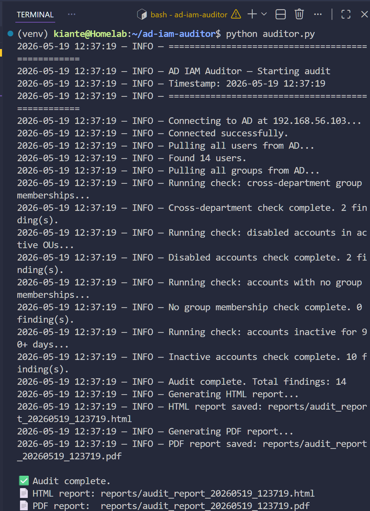
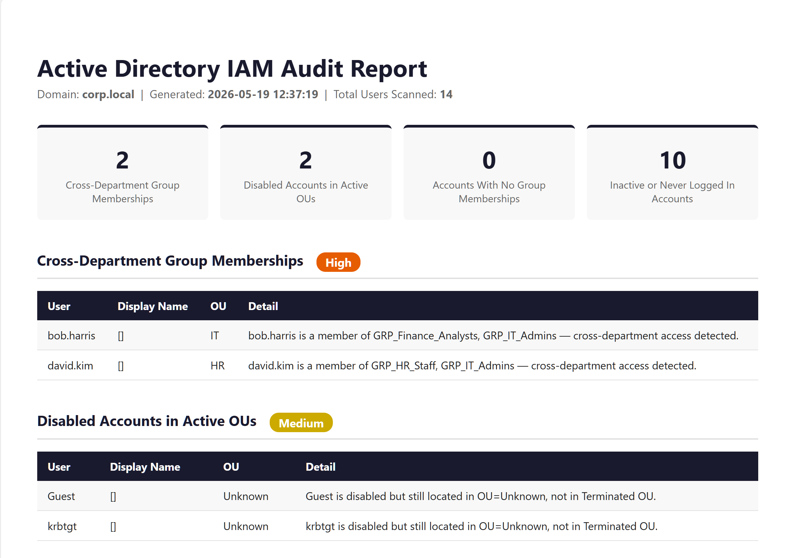
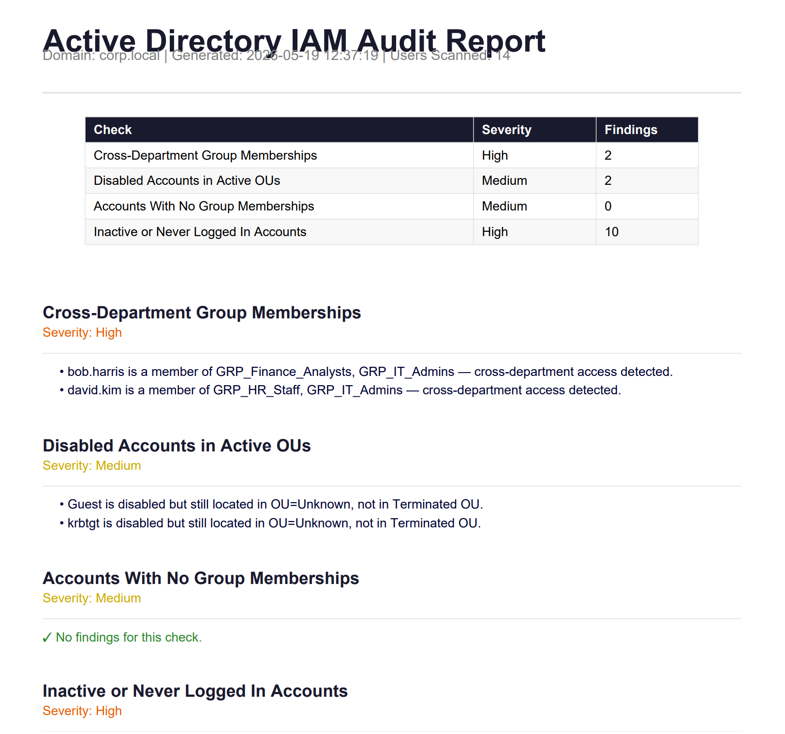

# AD IAM Auditor
### Live Active Directory Security Auditing — Automated PDF & HTML Report Generation


---

## Overview

AD IAM Auditor is a Python tool that connects live to an Active Directory environment via LDAPS, pulls all user and group data, runs four automated IAM security checks, and generates professional audit reports in both PDF and HTML format.

Built to automate the kind of manual access review work that security and IAM teams do regularly — identifying privilege drift, orphaned accounts, and access policy violations across an AD domain.

---

## Features

- **Live LDAPS connection** to Active Directory — no CSV exports, no manual queries
- **4 automated audit checks** covering the most common IAM risk areas
- **PDF report** — clean, formatted, ready to share with a security team
- **HTML report** — styled, browser-viewable, same content as PDF
- **Timestamped output** — every run generates a new dated report in `/reports`
- **Structured logging** — full audit trail of every check run

---

## Audit Checks

| Check | Severity | What It Catches |
|---|---|---|
| Cross-Department Group Memberships | High | Users holding group memberships outside their home department — privilege drift |
| Disabled Accounts in Active OUs | Medium | Disabled accounts not moved to Terminated OU — cleanup and compliance gap |
| Accounts With No Group Memberships | Medium | Enabled accounts with no group access — orphaned or misconfigured accounts |
| Inactive / Never Logged In Accounts | High | Accounts with no login in 90+ days or never logged in — stale access risk |

---

## Sample Reports

| Report | Format |
|---|---|
| [sample_report.pdf](./sample_report.pdf) | PDF — open directly in browser |

---

## Screenshots

### Script Running — Live LDAPS Connection & Audit Execution

> Live connection to AD at 192.168.56.103 via LDAPS. 14 users pulled, 4 checks executed, 14 total findings, both reports generated.

### HTML Report — Summary Dashboard & Findings

> Auto-generated HTML report showing summary cards and Cross-Department findings — Bob Harris (IT) in Finance group, David Kim (HR) in IT Admins group.

### PDF Report — Formatted Audit Deliverable

> Auto-generated PDF report with summary table, severity-coded findings sections, and full detail per check.

---

## Project Structure

```
ad-iam-auditor/
├── auditor.py          # Main script — LDAPS connection, audit logic, CLI
├── report.py           # Report generator — PDF (reportlab) + HTML (jinja2)
├── utils.py            # Shared helpers — logging, timestamps, severity colors
├── config.py           # AD connection settings — host, domain, credentials
├── requirements.txt    # Dependencies
├── reports/            # Generated reports (timestamped per run)
├── screenshots/        # Documentation screenshots
└── sample_report.pdf   # Pre-generated sample report
```

---

## Tech Stack

| Library | Purpose |
|---|---|
| `ldap3` | LDAPS connection and AD queries |
| `reportlab` | PDF report generation |
| `jinja2` | HTML report templating |
| `argparse` | CLI argument handling |
| `logging` | Structured audit logging |
| `ssl` | TLS configuration for LDAPS |

---

## Setup & Usage

### Prerequisites
- Python 3.10+
- Access to an Active Directory domain controller
- LDAPS (port 636) enabled on the DC
- AD account with read permissions

### Install

```bash
git clone https://github.com/CodeBroKinty/ad-iam-auditor.git
cd ad-iam-auditor
python3 -m venv venv
source venv/bin/activate
pip install -r requirements.txt
```

### Configure

Edit `config.py` with your AD connection details:

```python
AD_HOST = "your-dc-ip"
AD_DOMAIN = "your.domain"
AD_USER = "DOMAIN\\username"
AD_PASSWORD = "yourpassword"
AD_BASE_DN = "DC=your,DC=domain"
INACTIVE_DAYS_THRESHOLD = 90
```

### Run

```bash
python auditor.py
```

Reports are saved to `/reports` with a timestamp in the filename.

---

## How It Works

```
python auditor.py

1. Connects to AD via LDAPS (port 636) using TLS
2. Pulls all user objects with attributes:
   sAMAccountName, displayName, distinguishedName,
   memberOf, userAccountControl, lastLogon, department
3. Pulls all group objects
4. Runs 4 audit checks against the data
5. Passes findings to report generator
6. Outputs PDF and HTML reports to /reports
```

---

## Security Notes

- Connects via **LDAPS (port 636)** — encrypted transport, no plaintext credentials
- Self-signed cert support via `ssl.CERT_NONE` — configurable for production CA certs
- Credentials stored in `config.py` — add to `.gitignore` before pushing to public repos
- Audit logic is read-only — no writes to AD

---

## Related Projects

- [Active Directory IAM Lab](https://github.com/CodeBroKinty/active-directory-iam-lab) — The AD environment this tool was built and tested against

---

*Built by Kiante | 2026 | Python · ldap3 · Active Directory · LDAPS*
